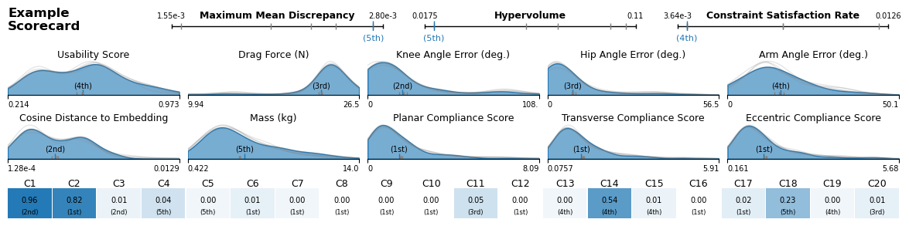
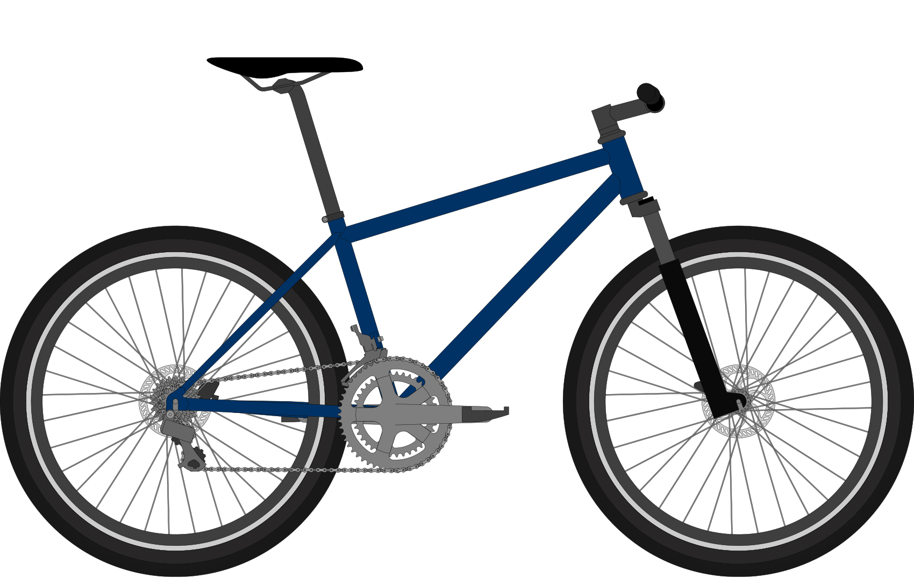

# Bike-Bench Repository (Temporary)

This is the temporary home of the **Bike-Bench** repository (pending official release).

Bike-Bench provides a standardized environment for evaluating and rendering bicycle frame designs using machine learning models, ergonomic simulations, and geometry-based constraints, and more. Bike-Bench suppors a variety of design generation algorithms spanning LLMS, tabular generative models, gradient-based and heuristic optimization, and Optimization-Augmented Generative Models

---

## 📦 Dataset Access

- The codebase supports **automatic downloading** of predictive and generative modeling datasets hosted on Harvard Dataverse when needed. These will be cached locally after first use.
- The **extended rendering dataset** is not currently used by the codebase, but can be manually accessed at:

  https://dataverse.harvard.edu/dataset.xhtml?persistentId=doi:10.7910/DVN/BSJSM6

---

## 🔧 Environment Setup

> **Note:** This environment should run the core design evaluation functionality.  
> Some models and optimization algorithms require additional dependencies to run.  
> Rendering requires Java — see below.

To set up the development environment using Conda or Mamba:

### 1. Clone the repository

```bash
git clone https://github.com/your-username/bikebench.git
cd bikebench
```

### 2. Create the environment

Using **Mamba** (recommended):

```bash
mamba env create -f env.yml
```

Or using **Conda**:

```bash
conda env create -f env.yml
```

### 3. Activate the environment

```bash
conda activate bike-bench
```

> Tip: You can rename the environment in `env.yml` under the `name:` field.

---

## ☕ Java Requirement for Rendering

Rendering functionality depends on a Java-based backend.  
You must have **Java 17 or newer** installed on your system.

Check your version with:

```bash
java -version
```

If you need to install or upgrade, Java distributions are available at:

- https://www.oracle.com/java/technologies/javase-downloads.html

---

## 🌟 Quality of Life Features

Bike-Bench includes several features designed to make experimentation and model evaluation easier:
- ✅ Automatic dataverse integration for fetching datasets
- ✅ Automated rendering of bike designs via a Java-based backend
- ✅ Prebuilt constraint and objective sets
- ✅ Automated evaluation and scoring pipelines
- ✅ Model scorecards for easy visualization of results

### 🔍 Model Scorecard Preview

Below is an example of the built-in scorecard system used to compare generative models:



### 🚴 Rendering Output Preview

Example of rendered bicycle geometry using the BikeCAD-based rendering backend:



---

## 📘 Coming Soon

- More usage examples and notebooks
- Model training tools
- Model leaderboards

